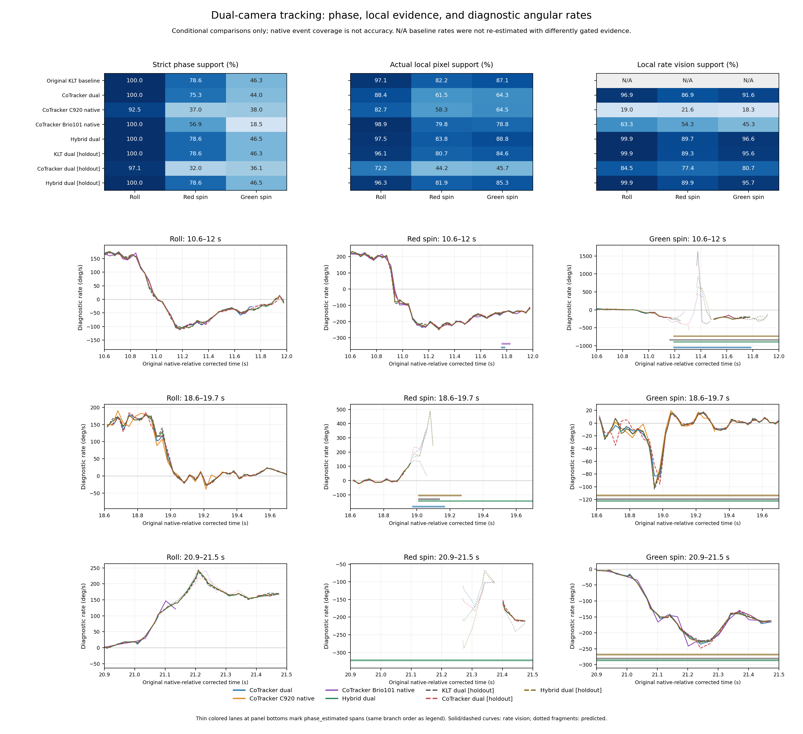

# Experiment comparison

Generated 2026-09-18T07:24:47.074966+00:00.

These are conditional consistency and observability comparisons, not angular accuracy measurements. Full-data and held-out evaluations use separate tables. A low scored-pixel error must be read with scored coverage and the failure-inclusive 3 px fraction.

Missing or incomplete branches: none.

## Full-data descriptive consistency

The reference pixels were not excluded from pose fitting in this group; these rows are not held-out accuracy tests.

| Branch | Median px | p95 px | Within 3 px / all candidates | Scored / candidates | Scored pixels |
|---|---:|---:|---:|---:|---:|
| CoTracker dual | 4.38 | 25.83 | 35.6% | 84.4% | 19781 |
| CoTracker C920 native | 4.29 | 28.90 | 34.5% | 80.2% | 18803 |
| CoTracker Brio101 native | 4.38 | 28.45 | 35.3% | 82.3% | 19271 |
| Hybrid dual | 4.13 | 24.82 | 36.8% | 85.4% | 20008 |

## Conditional held-out-track consistency

Whole reference tracks were excluded from this refinement, but every branch shares a full-data baseline initializer. The reference tracker and learned tracker also share source images. This is conditional validation, not an independent ground-truth test.

| Branch | Median px | p95 px | Within 3 px / all candidates | Scored / candidates | Scored pixels |
|---|---:|---:|---:|---:|---:|
| KLT dual [holdout] | 4.21 | 24.58 | 36.6% | 85.4% | 19998 |
| CoTracker dual [holdout] | 4.32 | 26.96 | 35.4% | 83.7% | 19611 |
| Hybrid dual [holdout] | 4.19 | 25.08 | 36.6% | 85.3% | 19984 |

Relative to the KLT holdout control (positive pixel deltas are larger errors):

- CoTracker dual [holdout]: median +0.11 px; p95 +2.39 px; scored coverage -1.7 percentage points; failure-inclusive 3 px fraction -1.1 percentage points.
- Hybrid dual [holdout]: median -0.02 px; p95 +0.50 px; scored coverage -0.1 percentage points; failure-inclusive 3 px fraction +0.0 percentage points.

These descriptive differences do not establish statistical significance or physical angular accuracy.

No comparable reference-pixel score available for: Original KLT baseline.

## Phase and local measurement coverage

Fractions use each branch’s emitted native events: both timelines for dual fits and only the active timeline for native mono refits. Event counts are not independent sample counts and raw mono/dual counts are not compared. Strict phase uses `strict_status` home/vision and finite strict angles. Local pixels require the actual event’s `visual_components`. Rate vision means the derivative functional passes the conditional temporal evidence test. Missing baseline rate annotation is N/A, not zero.

| Branch / component | Strict phase | Phase estimated | Actual local pixels | Rate vision | Final whole turns valid |
|---|---:|---:|---:|---:|---:|
| Original KLT baseline / roll | 100.0% | 0.0% | 97.1% | N/A | True |
| Original KLT baseline / red_spin | 78.6% | 21.4% | 82.2% | N/A | False |
| Original KLT baseline / green_spin | 46.3% | 53.7% | 87.1% | N/A | False |
| CoTracker dual / roll | 100.0% | 0.0% | 88.4% | 96.9% | True |
| CoTracker dual / red_spin | 75.3% | 4.0% | 61.5% | 86.9% | False |
| CoTracker dual / green_spin | 44.0% | 4.8% | 64.3% | 91.6% | False |
| CoTracker C920 native / roll | 92.5% | 0.0% | 82.7% | 19.0% | False |
| CoTracker C920 native / red_spin | 37.0% | 5.5% | 58.3% | 21.6% | False |
| CoTracker C920 native / green_spin | 38.0% | 4.6% | 64.5% | 18.3% | False |
| CoTracker Brio101 native / roll | 100.0% | 0.0% | 98.9% | 63.3% | True |
| CoTracker Brio101 native / red_spin | 56.9% | 4.1% | 79.8% | 54.3% | False |
| CoTracker Brio101 native / green_spin | 18.5% | 17.6% | 78.8% | 45.3% | False |
| Hybrid dual / roll | 100.0% | 0.0% | 97.5% | 99.9% | True |
| Hybrid dual / red_spin | 78.6% | 21.4% | 83.8% | 89.7% | False |
| Hybrid dual / green_spin | 46.5% | 53.5% | 88.8% | 96.6% | False |
| KLT dual [holdout] / roll | 100.0% | 0.0% | 96.1% | 99.9% | True |
| KLT dual [holdout] / red_spin | 78.6% | 0.6% | 80.7% | 89.3% | False |
| KLT dual [holdout] / green_spin | 46.3% | 53.7% | 84.6% | 95.6% | False |
| CoTracker dual [holdout] / roll | 97.1% | 0.0% | 72.2% | 84.5% | False |
| CoTracker dual [holdout] / red_spin | 32.0% | 3.5% | 44.2% | 77.4% | False |
| CoTracker dual [holdout] / green_spin | 36.1% | 1.8% | 45.7% | 80.7% | False |
| Hybrid dual [holdout] / roll | 100.0% | 0.0% | 96.3% | 99.9% | True |
| Hybrid dual [holdout] / red_spin | 78.6% | 1.1% | 81.9% | 89.9% | False |
| Hybrid dual [holdout] / green_spin | 46.5% | 53.5% | 85.3% | 95.7% | False |

Mono phase origins:

- CoTracker C920 native: Native mono refit: phase gauge at the first observed active-camera image; rates/windows aligned to the common physical clock.
- CoTracker Brio101 native: Native mono refit: phase gauge at the first observed active-camera image; rates/windows aligned to the common physical clock.

## Fast-motion windows

Reported speeds below use rate-vision events only and degrees/second. A derivative may remain observable inside a later phase component even after its accumulated phase becomes uncertain.

| Window s | Branch / component | Rate vision | Signed min | Signed max | p95 absolute | Phase estimated |
|---|---|---:|---:|---:|---:|---:|
| 10.6-12 | CoTracker dual / roll | 84.0% | -111.3 | 174.3 | 168.6 | 0.0% |
| 10.6-12 | CoTracker dual / red_spin | 100.0% | -245.5 | 220.8 | 232.0 | 2.5% |
| 10.6-12 | CoTracker dual / green_spin | 56.8% | -261.0 | 33.0 | 244.4 | 42.0% |
| 10.6-12 | CoTracker C920 native / roll | 0.0% | N/A | N/A | N/A | 0.0% |
| 10.6-12 | CoTracker C920 native / red_spin | 0.0% | N/A | N/A | N/A | 0.0% |
| 10.6-12 | CoTracker C920 native / green_spin | 0.0% | N/A | N/A | N/A | 0.0% |
| 10.6-12 | CoTracker Brio101 native / roll | 81.0% | -106.7 | 174.5 | 167.3 | 0.0% |
| 10.6-12 | CoTracker Brio101 native / red_spin | 100.0% | -237.8 | 225.3 | 229.1 | 4.8% |
| 10.6-12 | CoTracker Brio101 native / green_spin | 11.9% | -408.2 | 3.5 | 378.3 | 0.0% |
| 10.6-12 | Hybrid dual / roll | 100.0% | -107.4 | 176.1 | 169.8 | 0.0% |
| 10.6-12 | Hybrid dual / red_spin | 100.0% | -250.1 | 231.9 | 229.0 | 0.0% |
| 10.6-12 | Hybrid dual / green_spin | 60.5% | -265.0 | 18.6 | 254.2 | 55.6% |
| 10.6-12 | KLT dual [holdout] / roll | 100.0% | -108.4 | 175.9 | 171.4 | 0.0% |
| 10.6-12 | KLT dual [holdout] / red_spin | 100.0% | -243.9 | 230.3 | 224.2 | 0.0% |
| 10.6-12 | KLT dual [holdout] / green_spin | 58.0% | -263.2 | 16.0 | 231.9 | 58.0% |
| 10.6-12 | CoTracker dual [holdout] / roll | 100.0% | -112.3 | 170.9 | 166.4 | 0.0% |
| 10.6-12 | CoTracker dual [holdout] / red_spin | 100.0% | -243.9 | 217.1 | 230.2 | 0.0% |
| 10.6-12 | CoTracker dual [holdout] / green_spin | 49.4% | -262.6 | 22.2 | 241.7 | 0.0% |
| 10.6-12 | Hybrid dual [holdout] / roll | 100.0% | -108.3 | 175.5 | 170.8 | 0.0% |
| 10.6-12 | Hybrid dual [holdout] / red_spin | 100.0% | -251.0 | 230.5 | 229.1 | 0.0% |
| 10.6-12 | Hybrid dual [holdout] / green_spin | 60.5% | -264.8 | 18.3 | 253.5 | 55.6% |
| 18.6-19.7 | CoTracker dual / roll | 100.0% | -27.9 | 179.3 | 173.0 | 0.0% |
| 18.6-19.7 | CoTracker dual / red_spin | 30.3% | -22.0 | 69.8 | 53.2 | 18.2% |
| 18.6-19.7 | CoTracker dual / green_spin | 100.0% | -85.0 | 15.3 | 53.6 | 0.0% |
| 18.6-19.7 | CoTracker C920 native / roll | 66.7% | -38.4 | 190.5 | 182.0 | 0.0% |
| 18.6-19.7 | CoTracker C920 native / red_spin | 3.0% | 19.3 | 19.3 | 19.3 | 0.0% |
| 18.6-19.7 | CoTracker C920 native / green_spin | 66.7% | -101.8 | 19.6 | 68.3 | 0.0% |
| 18.6-19.7 | CoTracker Brio101 native / roll | 0.0% | N/A | N/A | N/A | 0.0% |
| 18.6-19.7 | CoTracker Brio101 native / red_spin | 0.0% | N/A | N/A | N/A | 0.0% |
| 18.6-19.7 | CoTracker Brio101 native / green_spin | 0.0% | N/A | N/A | N/A | 0.0% |
| 18.6-19.7 | Hybrid dual / roll | 100.0% | -25.0 | 179.1 | 172.4 | 0.0% |
| 18.6-19.7 | Hybrid dual / red_spin | 33.3% | -23.0 | 120.4 | 96.5 | 63.6% |
| 18.6-19.7 | Hybrid dual / green_spin | 100.0% | -98.9 | 17.2 | 55.6 | 100.0% |
| 18.6-19.7 | KLT dual [holdout] / roll | 100.0% | -26.9 | 176.2 | 173.9 | 0.0% |
| 18.6-19.7 | KLT dual [holdout] / red_spin | 30.3% | -20.7 | 68.3 | 45.3 | 12.1% |
| 18.6-19.7 | KLT dual [holdout] / green_spin | 100.0% | -103.8 | 16.6 | 55.7 | 100.0% |
| 18.6-19.7 | CoTracker dual [holdout] / roll | 100.0% | -23.4 | 185.4 | 172.8 | 0.0% |
| 18.6-19.7 | CoTracker dual [holdout] / red_spin | 30.3% | -19.0 | 71.8 | 52.2 | 0.0% |
| 18.6-19.7 | CoTracker dual [holdout] / green_spin | 100.0% | -96.1 | 17.2 | 56.2 | 0.0% |
| 18.6-19.7 | Hybrid dual [holdout] / roll | 100.0% | -24.4 | 178.0 | 172.5 | 0.0% |
| 18.6-19.7 | Hybrid dual [holdout] / red_spin | 33.3% | -23.0 | 124.1 | 94.5 | 24.2% |
| 18.6-19.7 | Hybrid dual [holdout] / green_spin | 100.0% | -98.3 | 17.8 | 55.0 | 100.0% |
| 20.9-21.5 | CoTracker dual / roll | 29.4% | -0.7 | 97.8 | 88.8 | 0.0% |
| 20.9-21.5 | CoTracker dual / red_spin | 17.6% | -211.6 | -158.3 | 211.2 | 0.0% |
| 20.9-21.5 | CoTracker dual / green_spin | 100.0% | -235.6 | -4.2 | 227.3 | 0.0% |
| 20.9-21.5 | CoTracker C920 native / roll | 0.0% | N/A | N/A | N/A | 0.0% |
| 20.9-21.5 | CoTracker C920 native / red_spin | 0.0% | N/A | N/A | N/A | 0.0% |
| 20.9-21.5 | CoTracker C920 native / green_spin | 0.0% | N/A | N/A | N/A | 0.0% |
| 20.9-21.5 | CoTracker Brio101 native / roll | 44.4% | 1.4 | 146.9 | 137.9 | 0.0% |
| 20.9-21.5 | CoTracker Brio101 native / red_spin | 0.0% | N/A | N/A | N/A | 0.0% |
| 20.9-21.5 | CoTracker Brio101 native / green_spin | 100.0% | -241.7 | -3.8 | 229.1 | 0.0% |
| 20.9-21.5 | Hybrid dual / roll | 100.0% | -0.9 | 241.8 | 218.0 | 0.0% |
| 20.9-21.5 | Hybrid dual / red_spin | 11.8% | -208.5 | -160.5 | 207.4 | 100.0% |
| 20.9-21.5 | Hybrid dual / green_spin | 100.0% | -230.1 | -2.9 | 225.7 | 100.0% |
| 20.9-21.5 | KLT dual [holdout] / roll | 100.0% | -2.0 | 238.0 | 213.1 | 0.0% |
| 20.9-21.5 | KLT dual [holdout] / red_spin | 0.0% | N/A | N/A | N/A | 0.0% |
| 20.9-21.5 | KLT dual [holdout] / green_spin | 100.0% | -225.9 | -2.3 | 222.7 | 100.0% |
| 20.9-21.5 | CoTracker dual [holdout] / roll | 52.9% | 1.1 | 169.3 | 167.6 | 0.0% |
| 20.9-21.5 | CoTracker dual [holdout] / red_spin | 17.6% | -212.7 | -152.3 | 212.4 | 0.0% |
| 20.9-21.5 | CoTracker dual [holdout] / green_spin | 100.0% | -248.7 | -3.7 | 234.3 | 0.0% |
| 20.9-21.5 | Hybrid dual [holdout] / roll | 100.0% | -0.6 | 243.9 | 217.8 | 0.0% |
| 20.9-21.5 | Hybrid dual [holdout] / red_spin | 17.6% | -210.9 | -162.1 | 210.6 | 0.0% |
| 20.9-21.5 | Hybrid dual [holdout] / green_spin | 100.0% | -227.7 | -2.4 | 225.8 | 100.0% |

## Interpretation limits

- Full-data reference consistency is descriptive. Only rows with both exclusion assertions are grouped as conditional track holdout.
- All refinements share the accepted full-data baseline initializer, including monocular and held-out branches; no independent from-scratch accuracy claim follows.
- Reference pixels share source images with learned observations. Camera geometry, roll, clock bias, track identity and exposure blur can bias all branches together.
- Pixel median and p95 apply to scored observations only; scored coverage and the 3 px fraction over all candidates include failure consequences.
- Local rate can be identified in a disconnected phase component. Phase-estimated spans do not imply every later local angular rate is unobserved.
- Rate vision is a conditional temporal nullspace test, not a covariance or accuracy bound. Roll additionally assumes locally pixel-supported pose samples.
- The 30 Hz local cubic derivative is a diagnostic interpolant of saved metric knots. It does not increase temporal bandwidth or correct exposure integration.
- Native camera events are correlated samples. Coverage fractions and plotted comparisons are descriptive, without statistical significance claims.
- Coverage fractions use each branch's emitted events. Native mono refits use active-camera timestamps only and anchor phase at their first observed image. Raw native-event counts cannot be compared as independent trials.
- When native mono refits are still pending, legacy mono results are labeled explicitly; their shared cam0 phase gauge can precede the first active-camera image and invalidate camera-benefit conclusions from phase coverage.
- Dotted predicted-rate fragments can show large prior/interpolant excursions in unsupported intervals; they are excluded from the rate-vision speed tables and are not measured peak speeds.
- The original baseline has no identically filtered rate annotation here; use the separately labeled KLT holdout control for comparable rate diagnostics.

Reproduce with `python scripts/compare_experiments.py`; rerunning updates the report as branches finish. Source paths and SHA-256 hashes are recorded in `comparison.json`.
